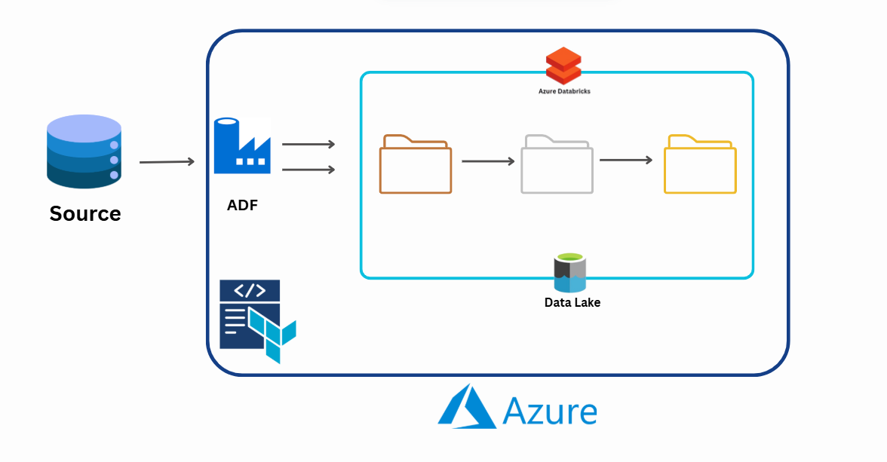

# Terraform Simple Tutorial

A simple tutorial for setting up Azure data pipeline infrastructure using Terraform.



## What it creates

- Azure Resource Group
- Azure Key Vault
- Azure Data Lake Storage Gen2
- Azure Data Factory
- Azure Databricks
- Storage containers (Bronze, Silver, Gold)

## Quick Start

1. **Login to Azure**
   ```bash
   az login
   ```

2. **Deploy infrastructure**
   ```bash
   cd Terraform
   terraform plan
   terraform apply
   ```

3. **Clean up when done**
   ```bash
   terraform destroy
   ```

## Files

- `main.tf` - Infrastructure configuration
- `providers.tf` - Azure provider setup

## Customisation

Edit variables in `main.tf`:
- `prefix` - Resource naming prefix (default: "erftut")
- `location` - Azure region (default: "australiaeast")

---

**Note**: This creates real Azure resources that may incur costs. Remember to destroy resources when finished. 